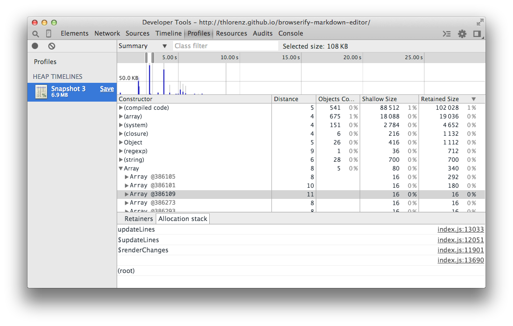
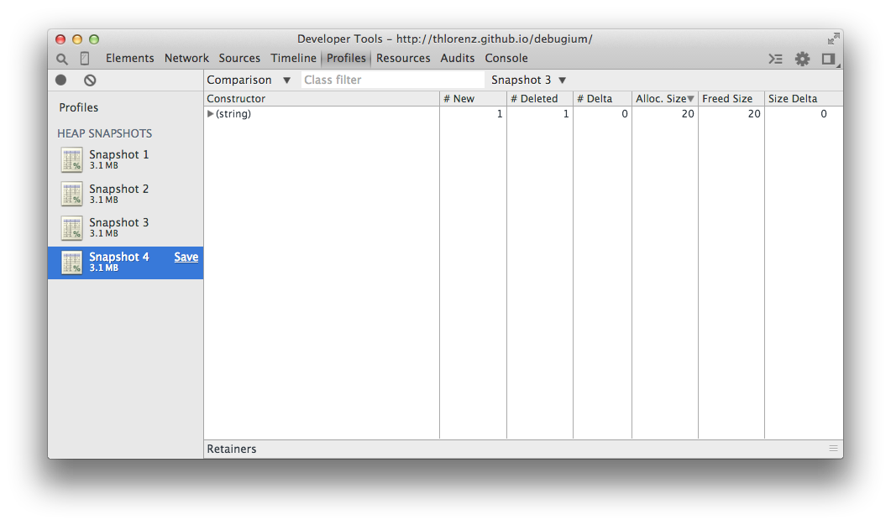
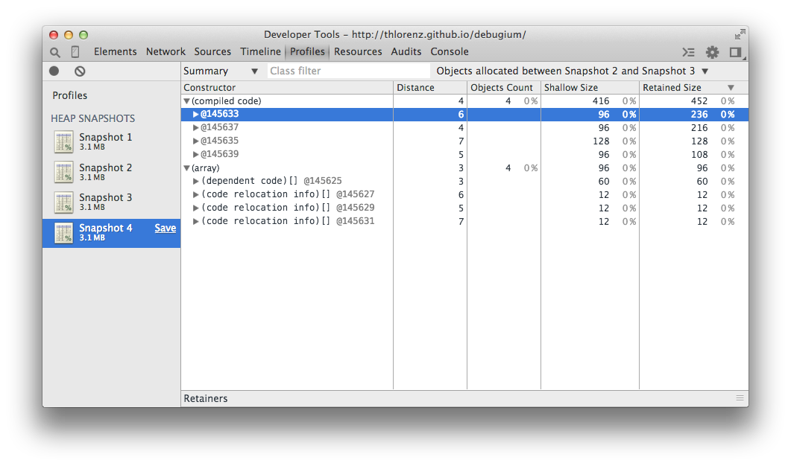

# Memory Profiling

<!-- START doctoc generated TOC please keep comment here to allow auto update -->
<!-- DON'T EDIT THIS SECTION, INSTEAD RE-RUN doctoc TO UPDATE -->
**Table of Contents**  *generated with [DocToc](https://github.com/thlorenz/doctoc)*

- [Theory](#theory)
  - [Objects](#objects)
    - [Shallow size](#shallow-size)
    - [Retained size](#retained-size)
      - [GC roots](#gc-roots)
    - [Storage](#storage)
    - [Object Groups](#object-groups)
  - [Retainers](#retainers)
  - [Dominators](#dominators)
  - [Causes for Leaks](#causes-for-leaks)
- [Tools](#tools)
  - [DevTools Allocation Timeline](#devtools-allocation-timeline)
    - [Allocation Stack](#allocation-stack)
    - [Recording Allocation Timeline with Node.js](#recording-allocation-timeline-with-nodejs)
  - [DevTools Allocation Profile](#devtools-allocation-profile)
    - [Recording Allocation Profile with Node.js](#recording-allocation-profile-with-nodejs)
  - [DevTools Heap Snapshots](#devtools-heap-snapshots)
    - [Taking Heap Snapshot with Node.js](#taking-heap-snapshot-with-nodejs)
    - [Views](#views)
      - [Color Coding](#color-coding)
      - [Summary View](#summary-view)
        - [Limiting included Objects](#limiting-included-objects)
      - [Comparison View](#comparison-view)
      - [Containment View](#containment-view)
        - [Entry Points](#entry-points)
      - [Dominators View](#dominators-view)
      - [Retainer View](#retainer-view)
    - [Constructors listed in Views](#constructors-listed-in-views)
      - [Closures](#closures)
        - [Advanced Comparison Technique](#advanced-comparison-technique)
    - [Dynamic Heap Limit and Large HeapSnapshots](#dynamic-heap-limit-and-large-heapsnapshots)
- [Considerations to make code easier to debug](#considerations-to-make-code-easier-to-debug)
- [Resources](#resources)
  - [blogs/tutorials](#blogstutorials)
  - [videos](#videos)
  - [slides](#slides)

<!-- END doctoc generated TOC please keep comment here to allow auto update -->

## Theory

### Objects

[read](https://developer.chrome.com/devtools/docs/javascript-memory-profiling#object-sizes)
[read](https://developers.google.com/web/tools/chrome-devtools/memory-problems/memory-101#object_sizes)

#### Shallow size

[read](https://developers.google.com/web/tools/chrome-devtools/memory-problems/memory-101#shallow_size)

- memory held by object **itself**
- arrays and strings may have significant shallow size

#### Retained size

[read](https://developers.google.com/web/tools/chrome-devtools/memory-problems/memory-101#retained_size)

- memory that is freed once object itself is deleted due to it becoming unreachable from *GC roots*
- held by object *implicitly*

##### GC roots

- made up of *handles* that are created when making a reference from native code to a JS object ouside of v8
- found in heap snapshot under **GC roots > Handle scope** and **GC roots > Global handles**
- internal GC roots are window global object and DOM tree

#### Storage

[read](https://developers.google.com/web/tools/chrome-devtools/memory-problems/memory-101#javascript_object_representation) |
[read](https://github.com/thlorenz/v8-perf/blob/master/data-types.md)

- primitives are leafs or terminating nodes
- strings stored in *VM heap* or externally (accessible via *wrapper object*)
- *VM heap* is heap dedicated to JS objects and managed byt v8 gargabe collector
- *native objects* stored outside of *VM heap*, not managed by v8 garbage collector and are accessed via JS *wrapper
  object*
- *cons string* object created by concatenating strings, consists of pairs of strings that are only joined as needed
- *arrays* objects with numeric keys, used to store large amount of data, i.e. hashtables (key-value-pair sets) are
  backed by arrays
- *map* object describing object kind and layout

#### Object Groups

[read](https://developers.google.com/web/tools/chrome-devtools/memory-problems/memory-101#object_groups)

- *native objects* group is made up from objects holding mutual references to each other
- not represented in JS heap -> have zero size
- wrapper objects created instead, each holding reference to corresponding *native object*
- object group holds wrapper objects creating a cycle
- GC releases object groups whose wrapper objects aren't referenced, but holding on to single wrapper will hold whole
  group of associated wrappers

### Retainers

[read](https://developers.google.com/web/tools/chrome-devtools/memory-problems/memory-101#objects_retaining_tree) |
[read](https://developer.chrome.com/devtools/docs/memory-analysis-101#retaining_paths)

- shown at the  bottom inside heap snapshots UI
- *nodes/objects* labelled by name of constructor function used to build them
- *edges* labelled using property names
- *retaining path* is any path from *GC roots* to an object, if such a path doesn't exist the object is *unreachable*
  and subject to being garbage collected

### Dominators

[read](https://developers.google.com/web/tools/chrome-devtools/memory-problems/memory-101#dominators) |
[read](https://en.wikipedia.org/wiki/Dominator_(graph_theory)) |
[read](https://developer.chrome.com/devtools/docs/memory-analysis-101#dominators)

- can be seen in [**Dominators** view](#dominators-view)
- tree structure in which each object has **one** dominator
- if *dominator* is deleted the *dominated* node is no longer reachable from *GC root*
- node **d** dominates a node **n** if every path from the start node to **n** must go through **d**

### Causes for Leaks

[read](http://addyosmani.com/blog/taming-the-unicorn-easing-javascript-memory-profiling-in-devtools/) *Understanding the Unicorn*

- logical errors in JS that keep references to objects that aren't needed anymore
  - number one error: event listeners that haven't been cleaned up correctly
- this causes an object to be considered live by the GC and thus prevents it from being reclaimed

## Tools

### DevTools Allocation Timeline

[watch](http://youtu.be/LaxbdIyBkL0?t=50m33s) |
[read](https://developers.google.com/web/tools/chrome-devtools/memory-problems/allocation-profiler)
(slightly out of date especially WRT naming, but does show the allocation timeline profiler) |
[read](https://developers.google.com/web/tools/chrome-devtools/memory-problems/#identify_js_heap_memory_leaks_with_allocation_timelines)

- **preferred over snapshot comparisons** to track down memory leaks
- *blue* bars show memory allocations
- *grey* bars show memory deallocations

#### Allocation Stack

[slides](https://speakerdeck.com/addyosmani/javascript-memory-management-masterclass?slide=102)
[watch](http://youtu.be/LaxbdIyBkL0?t=51m30s)

- _Allocation_ view (selectable in top left) shows allocations grouped by function and whose
  traces can be followed to see the function code responsible for the allocation

#### Recording Allocation Timeline with Node.js

- run app via `node --inspect` or `node --inspect-brk`
- open DevTools anywhere and click on the Node.js icon in the upper left corner to open a
  dedicated Node.js DevTools instance
- select the _Memory_ tab and there select _Record allocation timeline_ and then click _Start_
  - if you launched with `--inspect-brk` go back to the source panel to start debugging and
    then return to _Memory_ tab
- stop profiling via the red circle on the upper left and examine the timeline and related
  snapshots
- notice that the dropdown on the upper left has an _Allocations_ option which allows you to
  inspect allocations by function

### DevTools Allocation Profile

[read](https://developers.google.com/web/tools/chrome-devtools/memory-problems/#allocation-profile)

- helps identify functions responsible for allocating memory
- in case of memory leaks or performance issues due to lots of allocatd objects it can be used
  to track down which functions allocate most memory

#### Recording Allocation Profile with Node.js

- run app via `node --inspect` or `node --inspect-brk`
- open DevTools anywhere and click on the Node.js icon in the upper left corner to open a
  dedicated Node.js DevTools instance
- select the _Memory_ tab and there select _Record allocation profile_ and then click _Start_
  - the application will continue running automatically if it was paused, i.e. due to use of
    `--inspect-brk`
- stop profiling via the red circle on the upper left and select _Chart_ from the dropdown on
  the left
- you will see a function execution stack with the functions that allocated the most memory or
  had children that executed lots of memory being the widest

### DevTools Heap Snapshots

[read](https://developers.google.com/web/tools/chrome-devtools/memory-problems/heap-snapshots#take_a_snapshot)
_out of date graphics, but most still works as shown_
[read](https://developers.google.com/web/tools/chrome-devtools/memory-problems/#discover_detached_dom_tree_memory_leaks_with_heap_snapshots)
_example is about DOM nodes, but techniques apply in general_

- taking heap snapshots is quite easy, but the challenge is understanding whats in them
- when investigating leaks it is a good idea to trigger garbage collection right before taking
  a snapshot via the _collect garbage trashcan_ in the upper left

#### Taking Heap Snapshot with Node.js

- run app via `node --inspect`
- open DevTools anywhere and click on the Node.js icon in the upper left corner to open a
  dedicated Node.js DevTools instance
- select the _Memory_ tab and there select _Take Heap Snapshot_ and then click _Take Sanpshot_
- perform this multiple times in order to to detect leaks as explained in [advanced comparison
  technique](#advanced-comparison-technique)

#### Views

[overview](https://developer.chrome.com/devtools/docs/heap-profiling#basics) |
[overview](https://developers.google.com/web/tools/chrome-devtools/memory-problems/heap-snapshots#take_a_snapshot)

Even though views here are explained in conjunction with taking a heap snapshot, most of them
are also available when using any of the other techniques like _allocation profile_ or
_allocation timeline_.

##### Color Coding

[read](https://developers.google.com/web/tools/chrome-devtools/memory-problems/heap-snapshots#look_up_color_coding)

Properties and values are colored according to their types.

- *a:property* regular propertye, i.e. `foo.bar`
- *0:element* numeric index property, i.e. `arr[0]`
- *a:context var* variable in function context, accessible by name from inside function closure
- *a:system prop* added by JS VM and not accessible from JS code, i.e. v8 internal objects
- yellow objects are referenced by JS
- red objects are detached nodes which are referenced by yellow background object

##### Summary View

[read](https://developers.google.com/web/tools/chrome-devtools/memory-problems/heap-snapshots#summary_view)

- shows top level entries, a row per constructor
- columns for distance of the object to the *GC root*, number of object instances, shallow size and retained size.
- `@` character is objects’ unique ID, allowing you to compare heap snapshots on per-object basis

###### Limiting included Objects

- to the right of the View selector you can limit the objects by class name i.e. the name of the constructor function
- to the right of the class filter you can choose which objects to include in your summary (defaults to all)
  - select *objects allocated between heapdump 1 and heapdump 2* to identify objects that are still around in *heapdump
    3* but shouldn't be
  - another way to archieve similar results is by comparing two heapdumps (see below)

##### Comparison View

[read](https://developers.google.com/web/tools/chrome-devtools/memory-problems/heap-snapshots#comparison_view)

- compares multiple snapshots to each other
- note that **the preferred way to investigate leaks is the [advanced comparison
  technique](#advanced-comparison-technique)** using the summary view
- shows diff of both and delta in ref counts and freed and newly allocated memory
- used to find leaked objects
- after starting and completing (or canceling) the action, no garbage related to that action should be left
- note that garbage is collected each time a snapshot is taken, therefore remaining items are still referenced

1. Take bottom line snapshot
2. Perform operation that might cause a leak
3. Perform reverse operation and/or ensure that action `2` is complete and therefore all objects needed to perform it
   should no longer be needed
4. Take second snapshot
5. Compare both snapshots
    - select a Snapshot, then *Comparison* on the left and another Snapshot to compare it to on the right
    - the *Size Delta* will tell you how much memory couldn't be collected

##### Containment View

[read](https://developers.google.com/web/tools/chrome-devtools/memory-problems/heap-snapshots#containment_view)

- birds eye view of apps object structure
- low level, allows peeking inside function closures and look at VM internal objects
- used to determine what keeps objects from being collected

###### Entry Points

- *GC roots* actual GC roots used by garbage collector
- *DOMWindow objects* (not present when profiling Node.js apps)
- *Native objects* (not present when profiling Node.js apps)

Additional entry points only present when profiling a Node.js app:

- *1::* global object
- *2::* global object
- *[4] Buffer* reference to Node.js Buffers

##### Dominators View

[read](https://developers.google.com/web/tools/chrome-devtools/memory-problems/heap-snapshots#dominators_view)

- only available once *Settings/General/Profiler/Show advanced heap snapshot properties* is checked and browser
  refreshed afterwards
- shows dominators tree of heap
- similar to containment view but lacks property names since dominator may not have direct reference to all objects it
  dominates
- useful to identify memory accumulation points
- also used to ensure that objects are well contained instead of hanging around due to GC not working properly

##### Retainer View

- always shown at bottom of the UI
- displays retaining tree of currently selected object
- retaining tree has references going outward, i.e. inner item references outer item

#### Constructors listed in Views

[read](https://developer.chrome.com/devtools/docs/javascript-memory-profiling#memory-profiling-faq)

- *(global property)* intermediate object between global object and an object refereced by it
- *(roots)* root entries in retaining view are entities that reference the selected object
- *(closure)* count of references to a group of objects through function closures
- *(array, string, number, regexp)* list of object types with properties which reference an Array, String, Number or
  regular expression
- *(compiled code)* *SharedFunctionInfos* have no context and standibetween functions that do have context
- *(system)* references to builtin functions mainly `Map` (TODO: confirm and more details)

##### Closures

[read](http://zetafleet.com/blog/google-chromes-heap-profiler-and-memory-timeline)

- source of unintentional memory retention
- v8 will not clean up **any** memory of a closure untiil **all** members of the closure have gone out of scope
- therefore they should be used sparingly to avoid unnecessary [semantic
  garbage](https://en.wikipedia.org/wiki/Garbage_(computer_science))

###### Advanced Comparison Technique

[slides](https://speakerdeck.com/addyosmani/javascript-memory-management-masterclass?slide=102)

Use at least three snapshots and compare those.

1. Take bottom line snapshot *Checkpoint 1*
2. Perform operation that might cause a leak
3. Take snapshot *Checkpoint 2*
4. Perform same operation as in *2.*
5. Take snapshot *Checkpoint 3*

- all memory needed to perform action the first time should have been collected by now
- any objects allocated between *Checkpoint 1* and *Checkpoint 2* should be no longer present in *Checkpoint 3*
- select *Snapshot 3* and from the dropdown on the right select *Objects allocated between Snapshot 1 and 2*
- ideally you see no *Objects* that are created by your application (ignore memory that is unrelated to your action,
  i.e. *(compiled code)*)
- if you see any *Objects* that shouldn't be there but are in doubt create a 4th snapshot and select *Objects allocated
  between Snapshot 1 and 2* as shown in the picture below

#### Dynamic Heap Limit and Large HeapSnapshots

[read](https://v8project.blogspot.com/2017/02/one-small-step-for-chrome-one-giant.html) _One small step for Chrome, one giant heap for V8_

- v8's ability to dynamically increase its heap limit allows taking heap snapshot when close to
  running out of memory
- `set_max_old_space_size` is exposed to v8 embedders as part of the _ResourceConstraints_ API
  to allow them to increase the heap limit
- DevTools added feature to pause application when close to running out of memory
  1. pauses application and increases heap limit which allows taking a snapshot, inspect the
  heap, evaluate expressions, etc.
  2. developer can then clean up items that are taking up memory
  3. application can be resumed
- you can try it by running `node --inspect examples/memory-hog` in this repo, and opening a
  Node.js dedicated DevTools to see it it pause due to _potential out of memory crash_

## Considerations to make code easier to debug

The usefulness of the information presented in the views depends on how you authored your code. Here are a few
rules to make your code more debuggable.

Anonymous functions, i.e. `function() { ... }` show as `(anonymous)` and thus are hard to find
in your code. v8 + DevTools are getting smarter about this, i.e. for arrow functions where
`setTimeout(() => { ... }, TIMEOUT)` will show as `setTimeout` and you can navigate to the
function during a live profiling session.

However it is recommended to name your functions to make memory and performance profiling as
well as debugging your applications easier.

## Resources

### blogs/tutorials

Keep in mind that most of these are someehwat out of date albeit still useful.

- [chrome-docs memory profiling](https://developer.chrome.com/devtools/docs/javascript-memory-profiling)
- [chrome-docs Memory Analysis 101](https://developer.chrome.com/devtools/docs/memory-analysis-101) overlaps with chrome-docs memory profiling
- [chrome-docs heap profiling](https://developer.chrome.com/devtools/docs/heap-profiling) overlaps with chrome-docs memory profiling
- [Chasing Leaks With The Chrome DevTools Heap Profiler Views](https://plus.google.com/+AddyOsmani/posts/D3296iL3ZRE)
  - [heap profiler in chrome dev tools](http://rein.pk/using-the-heap-profiler-in-chrome-dev-tools/)
  - [performance-optimisation-with-timeline-profiles](http://addyosmani.com/blog/performance-optimisation-with-timeline-profiles/) time line data cannot be pulled out of a Node.js app currently, therfore skipping this for now
- [timeline and heap profiler](http://zetafleet.com/blog/google-chromes-heap-profiler-and-memory-timeline)
- [chromium blog](http://blog.chromium.org/2011/05/chrome-developer-tools-put-javascript.html)
- [Easing JavaScript Memory Profiling In Chrome DevTools](http://addyosmani.com/blog/taming-the-unicorn-easing-javascript-memory-profiling-in-devtools/)
- [Effectively Managing Memory at Gmail scale](http://www.html5rocks.com/en/tutorials/memory/effectivemanagement/)
- [javascript memory management masterclass](https://speakerdeck.com/addyosmani/javascript-memory-management-masterclass)
- [fixing memory leaks in drupal's editor](https://www.drupal.org/node/2159965)
- [writing fast memory efficient javascript](http://www.smashingmagazine.com/2012/11/05/writing-fast-memory-efficient-javascript/)
- [imgur avoiding a memory leak situation in JS](http://imgur.com/blog/2013/04/30/tech-tuesday-avoiding-a-memory-leak-situation-in-js/)

### videos

- [The Breakpoint Ep8: Memory Profiling with Chrome DevTools](https://www.youtube.com/watch?v=L3ugr9BJqIs)
- [Google I/O 2013 - A Trip Down Memory Lane with Gmail and DevTools](https://www.youtube.com/watch?v=x9Jlu_h_Lyw#t=1448)
- [Memory Profiling for Mere Mortals - 2016](https://www.youtube.com/watch?v=taADm6ndvVo)

### slides

- [Finding and debugging memory leaks in JavaScript with Chrome DevTools](http://www.slideshare.net/gonzaloruizdevilla/finding-and-debugging-memory-leaks-in-javascript-with-chrome-devtools)
- [eliminating memory leaks in Gmail](https://docs.google.com/presentation/d/1wUVmf78gG-ra5aOxvTfYdiLkdGaR9OhXRnOlIcEmu2s/pub?start=false&loop=false&delayms=3000#slide=id.g1d65bdf6_0_0)
- [Memory Profiling for Mere Mortals Slides - 2016](http://thlorenz.com/talks/memory-profiling.2016/book/)
